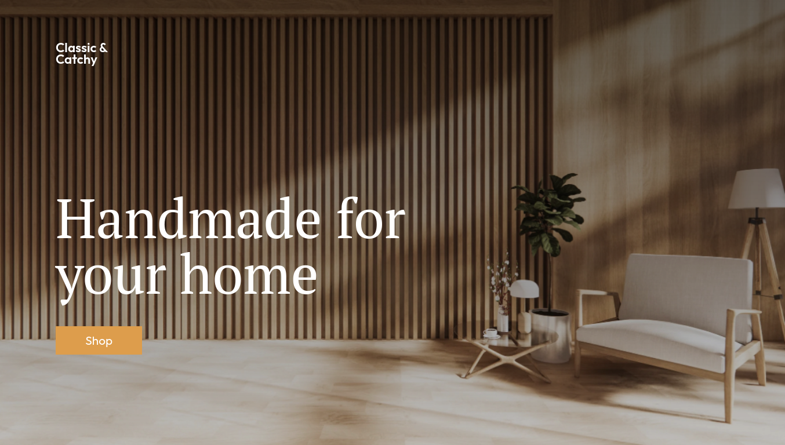

### Furniture single page website template

##### [watch on youtube](https://youtu.be/6Az1D22fN6E)

Furniture – Single Product Shop HTML CSS Theme is an elegantly designed and versatile Product theme that gives you smartly optimized page layouts and sections so you can easily create a stunning Product store for a furniture product. It incorporates a clean and modern design to give your website a professional look in little to no time.

It was designed for any e-commerce stores and diversified commodities as furniture store, fashion store, accessories store, shoes store, restaurant, mobile store, high tech store and multi-stores.

### Features
- [x] HTML5 & CSS3
- [x] No framework
- [x] Responsive Template
- [x] Free icons used
- [x] Pixel Perfect
- [x] Clean & Unique Design
- [x] Easy to customize
- [x] Retina Ready
- [x] Unlimited Colors
- [x] Boxed or Wide layout
- [x] SEO friendly
- [x] Super fast loading speed

.
.
.
.

.
.
.
##### Support me and my work to see more such projects
